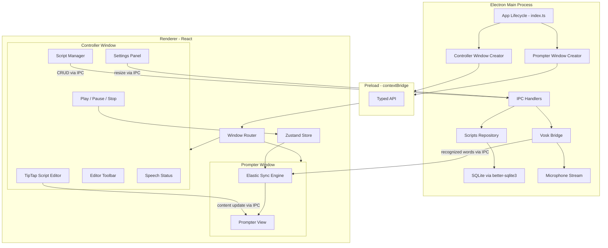
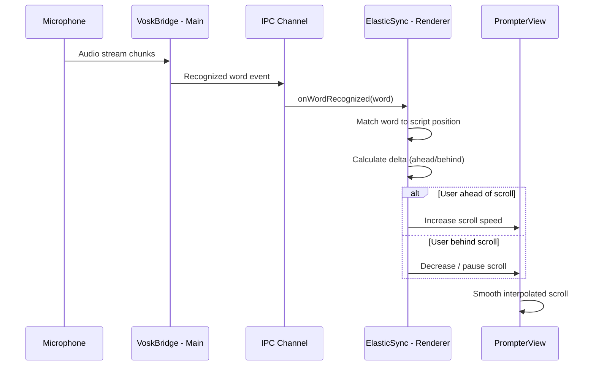

# NotchPrompter Architecture Plan

## Tech Stack

- **Electron** (main + renderer) via `electron-forge` with the Vite plugin for fast dev/build
- **React 18** + **TypeScript 5** in the renderer
- **TipTap** (ProseMirror-based) for the rich text editor
- **Vosk** (Node native bindings) for offline speech recognition
- **better-sqlite3** for local persistence
- **Zustand** for lightweight shared state in the renderer
- **Tailwind CSS** for styling

---

## Project Structure

```
NotchPrompter2me/
├── spec/
│   └── spec.md
├── forge.config.ts              # Electron Forge config
├── vite.main.config.ts          # Vite config for main process
├── vite.renderer.config.ts      # Vite config for renderer
├── vite.preload.config.ts       # Vite config for preload scripts
├── tsconfig.json
├── tailwind.config.ts
├── postcss.config.js
├── package.json
│
├── src/
│   ├── main/                    # Electron main process
│   │   ├── index.ts             # Entry — app lifecycle, creates windows
│   │   ├── windows/
│   │   │   ├── controller.ts    # Creates the Controller window
│   │   │   └── prompter.ts      # Creates the Prompter window (frameless, on-top)
│   │   ├── ipc/
│   │   │   ├── handlers.ts      # Registers all IPC handlers
│   │   │   ├── script.ipc.ts    # CRUD handlers for scripts (SQLite)
│   │   │   ├── vosk.ipc.ts      # Start/stop speech, forward words
│   │   │   └── window.ipc.ts    # Prompter resize, show/hide
│   │   ├── db/
│   │   │   ├── database.ts      # better-sqlite3 init, migrations
│   │   │   └── scripts.repo.ts  # Script CRUD operations
│   │   └── vosk/
│   │       └── vosk-bridge.ts   # Vosk model loader + mic stream → word events
│   │
│   ├── preload/
│   │   └── index.ts             # contextBridge.exposeInMainWorld — typed API
│   │
│   ├── renderer/                # React app (shared by both windows)
│   │   ├── index.html
│   │   ├── index.tsx            # React root; routes to Controller or Prompter
│   │   ├── App.tsx
│   │   ├── windows/
│   │   │   ├── ControllerWindow.tsx
│   │   │   └── PrompterWindow.tsx
│   │   ├── components/
│   │   │   ├── editor/
│   │   │   │   ├── ScriptEditor.tsx        # TipTap editor wrapper
│   │   │   │   └── EditorToolbar.tsx       # Bold/Italic/Underline/Strike
│   │   │   ├── prompter/
│   │   │   │   └── PrompterView.tsx        # Read-only rendered script with scroll
│   │   │   ├── controls/
│   │   │   │   ├── PlaybackControls.tsx    # Play / Pause / Stop buttons
│   │   │   │   ├── SettingsPanel.tsx       # Font, color, dimensions, WPM
│   │   │   │   └── ScriptManager.tsx       # Save / Load / Manage scripts
│   │   │   └── speech/
│   │   │       └── SpeechStatus.tsx        # Mic status, model loaded indicator
│   │   ├── hooks/
│   │   │   ├── useElasticSync.ts           # Core elastic scroll logic
│   │   │   └── useIpc.ts                   # Typed wrappers around preload API
│   │   ├── store/
│   │   │   ├── prompterStore.ts            # Zustand: playback state, scroll pos, WPM
│   │   │   └── scriptStore.ts              # Zustand: current script, editor content
│   │   └── styles/
│   │       └── globals.css                 # Tailwind directives + custom styles
│   │
│   └── shared/
│       ├── types.ts             # Script, Settings, IPC channel types
│       └── constants.ts         # Default WPM, default dimensions, notch offset
```

---

## Architecture Diagram




---

## Data Flow: Elastic Sync Scrolling




---

## IPC Contract (Channels)

All communication between main and renderer flows through typed IPC channels exposed via `contextBridge`:


| Channel                  | Direction              | Purpose                         |
| ------------------------ | ---------------------- | ------------------------------- |
| `script:create`          | Renderer -> Main       | Save a new script               |
| `script:read`            | Renderer -> Main       | Load a script by ID             |
| `script:list`            | Renderer -> Main       | List all saved scripts          |
| `script:update`          | Renderer -> Main       | Update an existing script       |
| `script:delete`          | Renderer -> Main       | Delete a script by ID           |
| `vosk:start`             | Renderer -> Main       | Start speech recognition        |
| `vosk:stop`              | Renderer -> Main       | Stop speech recognition         |
| `vosk:on-word`           | Main -> Renderer       | Forward recognized word         |
| `vosk:on-status`         | Main -> Renderer       | Model loaded / listening status |
| `window:resize-prompter` | Renderer -> Main       | Resize prompter dimensions      |
| `window:show-prompter`   | Renderer -> Main       | Show/hide prompter window       |
| `editor:content-update`  | Controller -> Prompter | Sync editor content to prompter |


---

## Database Schema

```sql
CREATE TABLE IF NOT EXISTS scripts (
    id          INTEGER PRIMARY KEY AUTOINCREMENT,
    title       TEXT    NOT NULL,
    body        TEXT    NOT NULL,   -- TipTap JSON serialized
    speech_speed INTEGER NOT NULL DEFAULT 150,  -- WPM
    settings    TEXT    NOT NULL DEFAULT '{}',   -- JSON blob
    created_at  TEXT    NOT NULL DEFAULT (datetime('now')),
    updated_at  TEXT    NOT NULL DEFAULT (datetime('now'))
);
```

The `settings` JSON column stores:

```typescript
interface ScriptSettings {
  fontFamily: string;   // e.g. "Inter", "System"
  fontSize: number;     // px
  fontColor: string;    // hex
  prompterWidth: number;
  prompterHeight: number;
}
```

---

## Window Configuration

**Prompter Window** (`[src/main/windows/prompter.ts](src/main/windows/prompter.ts)`):

- `frame: false`, `transparent: true`, `alwaysOnTop: true`
- `resizable: false`, `movable: false`, `focusable: false`
- Position: top-center of primary display, `y = 44` (below notch safe area)
- Default size: `width: 800`, `height: 80`

**Controller Window** (`[src/main/windows/controller.ts](src/main/windows/controller.ts)`):

- Standard window, `width: 900`, `height: 700`
- Centered on screen

---

## Key Implementation Details

### Two-Window Routing

Both windows load the same `index.html` but with a query param (e.g. `?window=controller` vs `?window=prompter`). The React root reads this and renders the appropriate window component.

### Editor-to-Prompter Content Sync

When the editor content changes, it is sent to the prompter window via IPC relay through main process (`BrowserWindow.webContents.send`). The prompter renders the same TipTap JSON as read-only with the user's font/color settings.

### Elastic Sync Algorithm (in `useElasticSync.ts`)

1. Maintain a pointer `currentWordIndex` into the script's word list.
2. On each `vosk:on-word` event, fuzzy-match the word to advance `currentWordIndex`.
3. Compute `targetScrollY` from `currentWordIndex` mapped to DOM position.
4. Compare `targetScrollY` vs `actualScrollY`:
  - If target is ahead: lerp scroll speed up (user speaking fast).
  - If target is behind: lerp scroll speed down or pause (user hesitating).
5. Use `requestAnimationFrame` for smooth interpolation.
6. Fallback: if Vosk is off, scroll at constant `baseWPM` rate.

### Vosk Bridge (in `src/main/vosk/vosk-bridge.ts`)

- Loads the Vosk model from a bundled or downloaded directory.
- Opens mic via Node `node-record-lpcm16` or similar.
- Pipes PCM audio into Vosk recognizer.
- Emits partial/final results to renderer via IPC.

---

## Build Steps (ordered)

These are the implementation steps once the plan is confirmed: