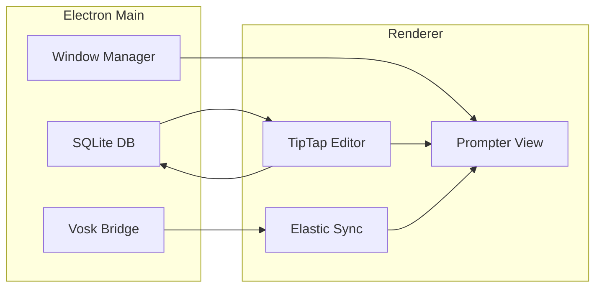

# NotchPrompter — Technical Specification

A desktop teleprompter for macOS that displays script text in a window positioned immediately below the MacBook notch, so the user appears to look at the camera while reading. Built with Electron, TypeScript, and React.

---

## 1. Architecture

- **Runtime**: Electron (main + renderer).
- **UI**: React with TypeScript.
- **Speech (offline)**: Vosk for local speech recognition (no cloud; works without internet).
- **Rich text**: TipTap for the script editor (bold, italic, underline, strike).
- **Database**: SQLite (e.g. via `better-sqlite3`) for local persistence of scripts and settings.

---

## 2. Window Strategy

- **Prompter window**:
  - **Frameless**, **transparent** (or very low opacity background), **always-on-top**.
  - **Position**: Top-center of the primary display, **immediately below the notch** (e.g. `y ≈ 44px` or use `screen.getDisplayNearestPoint()` / safe area if available).
  - **Not movable** by the user; position is fixed so the text sits in the camera line-of-sight.
- **Controller window** (separate, normal window):
  - Contains the script **editor**, **play/stop**, **settings** (dimensions, font, color, base speed), and optional **speech calibration**.
- **Dimensions**: User can set **width** and **height** of the prompter window only (no position controls). Defaults should fit a single line or a small block below the notch.

---

## 3. Scrolling Logic — Elastic Sync

- **Base behavior**: Constant scroll at a configurable **base speed** (e.g. words per minute, WPM).
- **Speech input**: Vosk runs **offline** and streams recognized words. The app matches recognized words to the **current script text** (e.g. by aligning to the next unspoken word or phrase).
- **Elastic sync**:  
  - **Speed up** scroll when the user is **ahead** of the current scroll position (e.g. speaking faster than base WPM).  
  - **Slow down or pause** when the user is **behind** (e.g. hesitating or reading slower).  
  - Smooth adjustments (e.g. target scroll position derived from “last spoken word” + small offset, with interpolated scroll).
- **Fallback**: If speech is unavailable or disabled, scrolling uses **only** the base WPM (manual speed control only).

---

## 4. Editor (Controller UI)

- **Component**: TipTap-based rich text editor.
- **Formatting**: **Bold**, **Italic**, **Underline**, **Strike** (strikethrough).
- **Data**: Editor content is the single source of truth for the script; the prompter view shows the same content (plain or rendered with the same formatting), with scroll position and Elastic Sync applied.

---

## 5. UI/UX — Settings and Prompter View

- **Font**: User can choose **font family** (system or safe list), **font size**, and **font color** for the prompter text.
- **Prompter dimensions**: User can set **width** and **height** of the prompter window (no position controls).
- **Prompter view**: Renders the script (from the editor) with the selected font/size/color; scroll position is driven by Elastic Sync (or base WPM only when speech is off).
- **Controller**: Clear **Play** / **Stop** (and optionally **Pause**), **Settings** panel for dimensions + font + color + base speed; optional section for **microphone** and **speech status** (listening / model loaded). **Script management**: **Save** (user gives a title; current editor content, WPM, and settings are stored), **Load** (list or picker of saved scripts; loads title, body, speech speed, and settings into editor and prompter), **Manage scripts** (list saved scripts; open, duplicate, delete).

---

## 6. Data Persistence (SQLite)

- **Technology**: SQLite, accessed from the Electron main process (e.g. `better-sqlite3`); renderer requests go via IPC.
- **Stored entity**: **Script** — one row per saved script.
- **Schema**:
  - **id**: Primary key (e.g. integer auto-increment or UUID).
  - **title**: Text; user-defined name for the script.
  - **body**: Text; rich-text content from the editor (e.g. TipTap JSON or HTML).
  - **speech_speed**: Integer; words per minute (WPM) for base scroll speed.
  - **settings**: Text (JSON); user settings for this script (e.g. `fontFamily`, `fontSize`, `fontColor`, `prompterWidth`, `prompterHeight`).
  - **created_at** / **updated_at** (optional): Timestamps for ordering and display.
- **Operations**: Create (save new script with name), Read (load script by id; list all for Load/Manage), Update (overwrite existing script by id), Delete (remove script by id).

---

## 7. Technical Notes

- **Vosk**: Integrate Vosk (e.g. Node bindings or subprocess) in the main process; send recognized words to the renderer via IPC. Use a language model that matches the user’s language (e.g. en-us).
- **Permissions**: Request **microphone** access when the user enables speech-controlled scrolling; explain usage in UI.
- **Performance**: Keep the prompter window lightweight (no heavy UI); run Vosk in main or a worker to avoid blocking the UI thread.

---

## 8. Out of Scope (for this spec)

- Moving the prompter window by drag.
- Cloud-based speech or other speech engines (only Vosk offline in scope).
- Video playback or recording inside the app.
- Multiple displays / notch detection on non-notched Macs (default to top-center with safe defaults).
